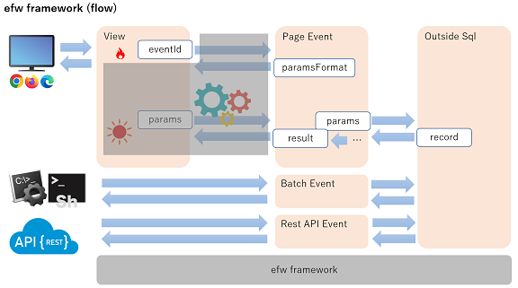
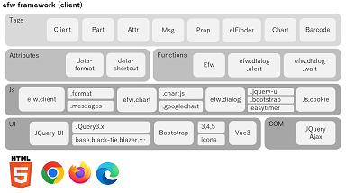
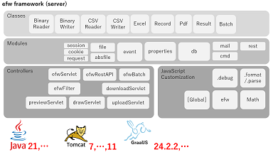

[English](README_E.md), [日本語](README_J.md), [中文](README_C.md)

## Introduction

&nbsp;&nbsp;&nbsp;&nbsp;&nbsp;&nbsp;&nbsp;&nbsp;&nbsp;&nbsp;&nbsp;&nbsp;&nbsp;&nbsp;&nbsp;&nbsp;&nbsp;&nbsp;
 

* [What is Efw?](https://qiita.com/changkejun/items/844953846f3e6bed4a9d)
* [Efw Security Related Explanation](https://qiita.com/changkejun/items/70184f814ff52f862d91)
* [Build a High Loads Tomcat Environment](https://qiita.com/changkejun/items/fb325ed0a9d81f3bf5f0)

## Samples

* [Test Each Type of Input Element](https://qiita.com/changkejun/items/2f59403e8fa3b0f40eb7) ([helloworld/InputTest.jsp](https://github.com/efwGrp/qittaSamples/tree/main/helloworld/InputTest.jsp))
* [Test Each Type of Value Display](https://qiita.com/changkejun/items/f634ae1c8040cef4cc01) ([helloworld/OutputTest.jsp](https://github.com/efwGrp/qittaSamples/tree/main/helloworld/OutputTest.jsp))
* [Test Each Type of Screen Action](https://qiita.com/changkejun/items/3accadd827594d1bccdf) ([helloworld/ActionTest.jsp](https://github.com/efwGrp/qittaSamples/tree/main/helloworld/ActionTest.jsp))
* [Web File Management with One Tag](https://qiita.com/changkejun/items/3f943f089d44d83296af) ([helloworld/helloElfinder.jsp](https://github.com/efwGrp/qittaSamples/tree/main/helloworld/helloElfinder.jsp))
* [Web Chart Function with One Tag](https://qiita.com/changkejun/items/dc976ccaaf82458c7771) ([helloworld/helloChart.jsp](https://github.com/efwGrp/qittaSamples/tree/main/helloworld/helloChart.jsp))
* [Create Web QR Code with One Tag](https://qiita.com/changkejun/items/0cdef7d8d288f9f0a563) ([helloworld/helloBarcode.jsp](https://github.com/efwGrp/qittaSamples/tree/main/helloworld/helloBarcode.jsp))
* [Let's Graduate from POI](https://qiita.com/changkejun/items/5f6c5b234dc1322ec859) ([helloworld/helloExcelbyPOI.jsp](https://github.com/efwGrp/qittaSamples/tree/main/helloworld/helloExcelbyPOI.jsp))
* [Don't be Afraid of Gigabytes of Text](https://qiita.com/changkejun/items/97af2b8722c149f5335d) ([helloworld/helloTextCSVThread.jsp](https://github.com/efwGrp/qittaSamples/tree/main/helloworld/helloTextCSVThread.jsp))
* [Introduction to Database Processing](https://qiita.com/changkejun/items/d046d1804b4c996700e2) ([helloworld/helloDB.jsp](https://github.com/efwGrp/qittaSamples/tree/main/helloworld/helloDB.jsp))
* [Send to Gmail SMTP](https://qiita.com/changkejun/items/26fe53af470ee1a96b05) ([helloworld/helloMail.jsp](https://github.com/efwGrp/qittaSamples/tree/main/helloworld/helloMail.jsp))
* [Multilingual Support](https://qiita.com/changkejun/items/7d0999b90b0e5370f928) ([helloworld/helloI18n.jsp](https://github.com/efwGrp/qittaSamples/tree/main/helloworld/helloI18n.jsp))
* [Let's Create a Rest API Service](https://qiita.com/changkejun/items/54c3df529a1b83093790) ([helloworld/helloRestAPI.jsp](https://github.com/efwGrp/qittaSamples/tree/main/helloworld/helloRestAPI.jsp))
* [Web App Login Control & Authority Control](https://qiita.com/changkejun/items/c36d3671493225ad14ce) ([skeletonSample](https://github.com/efwGrp/qittaSamples/tree/main/skeletonSample))
* [Try to use pdf-lib and pdfmake on Efw with Javet](https://qiita.com/changkejun/items/5f50cf3d3e935dd90989) ([hello-pdf-lib3](https://github.com/efwGrp/qittaSamples/tree/main/hello-pdf-lib3), [hello-pdfmake3](https://github.com/efwGrp/qittaSamples/tree/main/hello-pdfmake3))

* [dialog](samples/dialogSample)
* [batch](samples/batchSample)
* [helloAzure](samples/helloAzure)

# [API](help/e/api.md)

# They use our products

 
 
 
 
 
 

