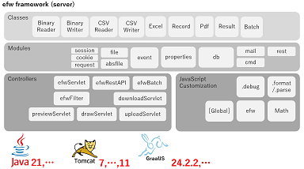

[English](README_E.md), [日本語](README_J.md), [中文](README_C.md)

## はじめに

&nbsp;&nbsp;&nbsp;&nbsp;&nbsp;&nbsp;&nbsp;&nbsp;&nbsp;&nbsp;&nbsp;&nbsp;&nbsp;&nbsp;&nbsp;&nbsp;&nbsp;&nbsp;
 

* [Efwとは](https://qiita.com/changkejun/items/d9ef1bbffecb8dab4ffc)
* [Efwのセキュリティ関連の説明](https://qiita.com/changkejun/items/5e10a96e0b1efce8653e)
* [高負荷対応のTomcat環境構築](https://qiita.com/changkejun/items/1d850b109f8b26381268)
* [EFWコーディング規約](https://qiita.com/Victory963/items/ec028606e382a1d3a174)

## サンプル

* [各種類の入力枠を一括テスト](https://qiita.com/changkejun/items/926a29ef46714d8cf9f1) ([helloworld/InputTest.jsp](https://github.com/efwGrp/qittaSamples/tree/main/helloworld/InputTest.jsp))
* [各種類の値表示をテストする](https://qiita.com/changkejun/items/194b6c300c82167acddc) ([helloworld/OutputTest.jsp](https://github.com/efwGrp/qittaSamples/tree/main/helloworld/OutputTest.jsp))
* [各種類の画面アクションをテストする](https://qiita.com/changkejun/items/c1369438843759d0e890) ([helloworld/ActionTest.jsp](https://github.com/efwGrp/qittaSamples/tree/main/helloworld/ActionTest.jsp))
* [タグ１つでwebのファイル管理](https://qiita.com/changkejun/items/d79127e27b49bfc8a847) ([helloworld/helloElfinder.jsp](https://github.com/efwGrp/qittaSamples/tree/main/helloworld/helloElfinder.jsp))
* [タグ１つでwebのチャート機能](https://qiita.com/changkejun/items/b563570df2036f5fa7da) ([helloworld/helloChart.jsp](https://github.com/efwGrp/qittaSamples/tree/main/helloworld/helloChart.jsp))
* [タグ１つでwebのQRコード作成](https://qiita.com/changkejun/items/106f2734dd319e9b1201) ([helloworld/helloBarcode.jsp](https://github.com/efwGrp/qittaSamples/tree/main/helloworld/helloBarcode.jsp))
* [POIから卒業しましょう](https://qiita.com/changkejun/items/dea128563b608b7dcb43) ([helloworld/helloExcelbyPOI.jsp](https://github.com/efwGrp/qittaSamples/tree/main/helloworld/helloExcelbyPOI.jsp))
* [ギガバイトのテキストを恐れなし](https://qiita.com/changkejun/items/2777f3006c4a0b8d2213) ([helloworld/helloTextCSVThread.jsp](https://github.com/efwGrp/qittaSamples/tree/main/helloworld/helloTextCSVThread.jsp))
* [efwのデータベース処理に関する紹介](https://qiita.com/changkejun/items/b273b3ae64c76e5b016a) ([helloworld/helloDB.jsp](https://github.com/efwGrp/qittaSamples/tree/main/helloworld/helloDB.jsp))
* [efwを利用してGmailのSMTPへ送信](https://qiita.com/changkejun/items/c237ddbc69c9c4cb3319) ([helloworld/helloMail.jsp](https://github.com/efwGrp/qittaSamples/tree/main/helloworld/helloMail.jsp))
* [efwの多国語対応](https://qiita.com/changkejun/items/e4afa094a606c14698f3) ([helloworld/helloI18n.jsp](https://github.com/efwGrp/qittaSamples/tree/main/helloworld/helloI18n.jsp))
* [Rest API サービスを作りましょう](https://qiita.com/changkejun/items/70ac1778acd146ad0f9c) ([helloworld/helloRestAPI.jsp](https://github.com/efwGrp/qittaSamples/tree/main/helloworld/helloRestAPI.jsp))
* [efwのwebアプリのログイン制御＆権限制御](https://qiita.com/changkejun/items/2e7a68149eab8f2281cf) ([skeletonSample](https://github.com/efwGrp/qittaSamples/tree/main/skeletonSample))
* [Javetを利用して、pdf-libとpdfmakeをefwに使ってみる](https://qiita.com/changkejun/items/350ca12a3276c4d1378a) ([hello-pdf-lib3](https://github.com/efwGrp/qittaSamples/tree/main/hello-pdf-lib3), [hello-pdfmake3](https://github.com/efwGrp/qittaSamples/tree/main/hello-pdfmake3))

* [dialog](samples/dialogSample)
* [batch](samples/batchSample)
* [helloAzure](samples/helloAzure)

# [API](help/j/api.md)

# 導入実績

 
 
 
 
 
 

